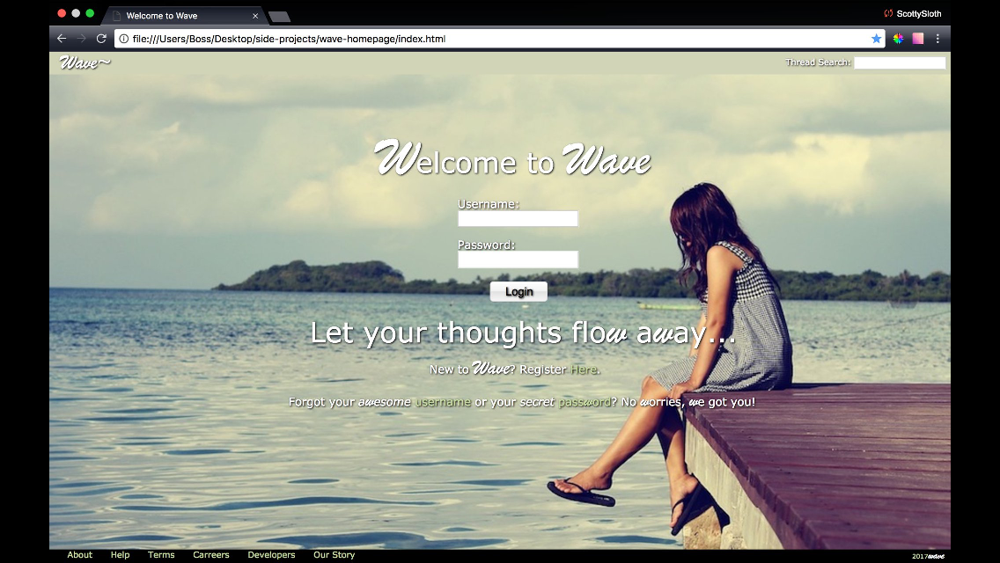

##Wave

The Future of Wave:
			Social media site where users can post on a live feed (called waves) that when scrolled down gets deeper and deeper into an ocean theme.
			There will be a message in a bottle (m.i.b) system where users can send a message or picture and it pops up on the screen of a random online user and they are able to start a direct message. (toggle able)
			Users will be able to create a search-able thread like those of a forum to be able to 				converse with others about certain topics of their choosing.
			Users can direct message other users either by first being messaged by them randomly through m.i.b’s or by simply clicking direct message on another users profile.

			#Note
			* m.i.b’s will delete themselves after 15 seconds without any action.
